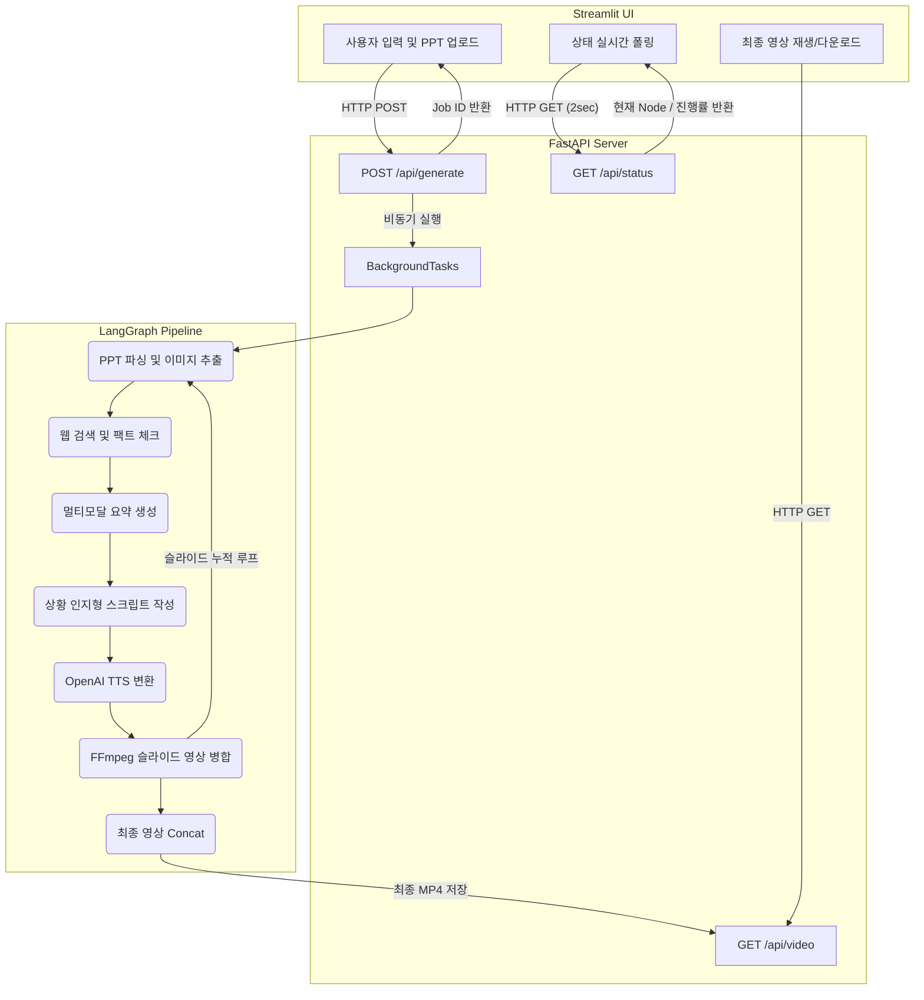

# 🎬 Lecture Agent Studio

[](https://www.python.org/)
[](https://python.langchain.com/docs/langgraph)
[](https://fastapi.tiangolo.com/)
[](https://streamlit.io/)

**Lecture Agent Studio**는 PPTX 파일을 업로드하면 AI가 슬라이드를 심층 분석하여 대본을 작성하고, AI 성우의 더빙을 입혀 최종 강의 영상(MP4)을 자동으로 생성해 주는 **완전 자동화 멀티모달 AI 파이프라인**입니다.


<p align="center">
  <video src="https://github.com/user-attachments/assets/560c9a99-bb18-4551-9b7b-2eb8f65b0b1b" controls autoplay muted loop width="80%"></video>
</p>


---

## 🏗️ System Architecture


이 프로젝트는 무거운 영상 렌더링 작업을 처리하기 위해 **클라이언트-서버 구조**와 **비동기 백그라운드 작업(Background Tasks)**을 채택했습니다. 



---

## 🧠 핵심 로직 및 문제 해결 (Core Features)

단순한 API 호출을 넘어, 데이터의 품질과 파이프라인의 안정성을 높이기 위해 다음과 같은 기술적 고민을 담았습니다.

### 1. 다중 모달 파싱 (Multi-modal Parsing)
단순한 텍스트 추출의 한계를 극복하기 위해 `python-pptx`와 `LibreOffice`를 결합했습니다.
- 본문 텍스트 외에 **숨겨진 도형(Group) 안의 텍스트, 표(Table), 차트(Chart) 수치, 발표자 노트(Notes)**를 완벽하게 추출합니다.
- 슬라이드 전체를 고화질 PNG로 캡처하여 `gpt-4o`의 Vision 기능과 결합, 텍스트로 표현되지 않은 시각적 맥락(Diagram, 이미지 속 숫자)까지 LLM에 전달합니다.

### 2. 신뢰성 높은 외부 검색 (Cross-Validation RAG)
Tavily Search API를 사용하여 최신 정보로 슬라이드 내용을 보완합니다. 환각(Hallucination)을 방지하기 위한 안전장치를 구현했습니다.
- **다중 쿼리 생성**: 제목, 본문, 표 데이터를 조합하여 여러 개의 검색 쿼리를 동시 발생시킵니다.
- **교차 검증 (Cross-Validation)**: 검색된 결과들 사이의 `SequenceMatcher` 유사도를 분석하고, 최소 2개 이상의 서로 다른 도메인(출처)에서 교차 검증된 내용만 요약 노트에 반영합니다.

### 3. 상황 인지형 스크립트 생성 (Context-Aware Scripting)
LLM 특유의 "기계적이고 반복적인 말투"를 억제하기 위한 프롬프트 엔지니어링을 적용했습니다.
- **반복 방지 알고리즘**: 이전 슬라이드에서 사용된 '첫 문장(시작어)'을 추출해 다음 슬라이드 프롬프트에 주입하여 유사한 시작을 원천 차단합니다.
- **포스트 프로세싱**: 15개 이상의 금지어(예: "이번 슬라이드에서는")를 정규식으로 필터링하고, "여러분" 같은 추임새의 등장 빈도(`count_word`, `limit_word`)를 제한합니다.

### 4. 미디어 파이프라인 (FFmpeg & TTS)
- **오디오 배속 처리**: OpenAI TTS 생성 후, 사용자가 설정한 배속(`atempo` 필터)에 맞게 즉시 오디오를 변환합니다.
- **동적 영상 렌더링**: 음성 길이를 `ffprobe`로 측정하여 슬라이드 이미지를 해당 길이만큼 복제하고 해상도를 동적으로 패딩/스케일링(Scale/Pad)하여 1080p 고화질 영상으로 병합합니다.

---

## 🛠️ 기술 스택 (Tech Stack)

| Category | Technologies |
| :--- | :--- |
| **Frontend** | Streamlit |
| **Backend** | FastAPI, Uvicorn, Python `BackgroundTasks` |
| **AI / Agent** | LangGraph, LangChain, OpenAI (`gpt-4o`, `tts-1`), Tavily API |
| **Media / Parsing** | FFmpeg, LibreOffice (`soffice`), `python-pptx` |

---

## 🚀 설치 및 실행 방법 (Getting Started)

### 1. 필수 시스템 요구사항 (Prerequisites)
- **Python 3.11+**
- **FFmpeg**: 환경 변수(PATH)에 등록되어 있어야 합니다.
- **LibreOffice**: 슬라이드 PNG 캡처를 위해 필요합니다. (Windows의 경우 기본 경로 자동 탐색 지원)

### 2. 레포지토리 클론 및 의존성 설치
```bash
git clone https://github.com/your-username/lecture-agent-studio.git
cd lecture-agent-studio

# 가상환경 생성 및 활성화
python -m venv venv
source venv/Scripts/activate  # Windows

# 패키지 설치
pip install -r requirements.txt
```

### 3. 환경 변수 설정
최상단 디렉토리에 `.env` 파일을 생성하고 다음 API 키를 입력합니다.
```env
OPENAI_API_KEY="sk-your-openai-api-key"
TAVILY_API_KEY="tvly-your-tavily-api-key"
LLM_MODEL="gpt-4o"
TTS_MODEL="tts-1"
```

### 4. 애플리케이션 실행
이 프로젝트는 서버와 UI를 분리하여 실행합니다. 터미널을 2개 열어주세요.

**Terminal 1 (Backend - FastAPI)**
```bash
uvicorn main:app --port 8000
```

**Terminal 2 (Frontend - Streamlit)**
```bash
streamlit run app.py --server.port 8501
```

이후 브라우저에서 `http://localhost:8501`에 접속하여 서비스를 이용할 수 있습니다.

---

## 💡 향후 개선 과제 (Future Works)

- [ ] **분산 큐 시스템 도입**: 현재의 인메모리(BackgroundTasks) 방식을 넘어, Celery와 Redis를 활용한 대규모 트래픽 분산 처리 구조로 확장.
- [ ] **Docker 컨테이너화**: FFmpeg 및 LibreOffice 설치의 번거로움을 줄이기 위한 `Dockerfile` 및 `docker-compose` 제공.
- [ ] **애니메이션 지원**: 정적 이미지(PNG) 캡처를 넘어 슬라이드 내 애니메이션 싱크에 맞춘 비디오 레코딩 기능 추가.

---
*Created as a Portfolio Project by [Your Name]*
